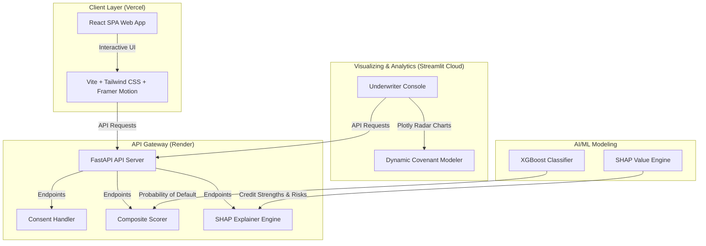

# 💳 MSME Financial Health Card: Alternate Data Underwriting Engine
> **An AI/ML-driven composite scoring & risk evaluation platform designed for India's digital public infrastructure.**

[](https://msme-financial-health-card-1.onrender.com/docs)
[](https://msme-financial-health-card-cgjnkyrsatefgqvbsmg2gg.streamlit.app/)
[](https://msme-financial-health-card-w4wa.vercel.app/)
[](https://python.org)
[](https://github.com/Sourabh-Singh-Chuphal/msme-financial-health-card/actions)

Traditional credit scoring models exclude millions of New-to-Credit (NTC) and New-to-Bank (NTB) MSMEs in India due to lack of formal credit history. This platform solves information asymmetry by aggregating consent-based alternate data sources—**GST filings, UPI transactional flows, EPFO payroll contributions, and bank statement logs (Account Aggregator)**—to compile a real-time **Financial Health Card** with high transparency and explainable risk modeling.

---

## 🔗 Live Deployments

* **💻 Client Portal (Vercel):** [msme-financial-health-card-w4wa.vercel.app](https://msme-financial-health-card-w4wa.vercel.app/)
* **📊 Underwriter Dashboard (Streamlit):** [msme-financial-health-card-cgjnkyrsatefgqvbsmg2gg.streamlit.app/](https://msme-financial-health-card-cgjnkyrsatefgqvbsmg2gg.streamlit.app/)
* **🔌 API Gateway & Documentation (Render):** [msme-financial-health-card-1.onrender.com/docs](https://msme-financial-health-card-1.onrender.com/docs)

---

## 🛠️ Core Innovations

### 1. Unified Lending Interface (ULI) Ingestion
Simulates the ULI consent framework. Validates alternate data feeds using strict Pydantic schemas before feeding them to the underwriting pipelines.

### 2. Composite Decision Engine
Blends **Rule-Based Decision Trees** (evaluating basic operational sanity, tax compliance, and business age) with a trained **XGBoost Machine Learning Classifier** (predicting the Probability of Default based on transaction patterns).

### 3. Explainable AI (XAI) with SHAP
Translates complex ML decision boundaries into plain-English credit notes. Using SHapley Additive exPlanations, it exposes the top 3 credit strengths and risk factors for every single applicant.

### 4. OCEN v4 Multi-Lender Bid Matching
Aggregates competitive bids from network banks based on the borrower's risk profile and dynamically adjusts interest rates and credit limits when underwriters apply risk covenants (e.g., *UPI Escrow Locks*, *Promoter Guarantees*).

---

## 📊 System Architecture



---

## ⚙️ Local Development Setup

Get the entire pipeline up and running in **5 simple commands**:

### 1. Install Dependencies
```bash
pip install -r requirements.txt
```

### 2. Generate MSME Sandbox Cohort
Creates a database of 200 synthetic MSMEs representing 5 distinct risk personas:
```bash
python data/synthetic_generators/generate_cohort.py
```

### 3. Train the XGBoost Underwriter Model
Trains the classifier and logs model metrics (ROC-AUC, True Positive Rate):
```bash
python src/scoring/train_model.py
```

### 4. Launch FastAPI Server
```bash
uvicorn src.api.main:app --port 8000
```

### 5. Launch Streamlit Underwriter Console
```bash
streamlit run dashboard/app.py
```

---

## 🧪 Testing and Quality Control

Run the full suite of **111 unit, integration, and E2E validation tests** (checking mathematical scoring limits, Pydantic inputs, and SHAP monotonic bounds):
```bash
pytest --cov=src --cov-report=xml
```

---

## 📁 Repository Map

```text
├── dashboard/                     # Streamlit dashboard source
│   └── app.py                     # Visual portal & dynamic covenant controller
├── data/                          # Data store & cohort generators
│   └── synthetic_generators/      # Scripts for generating 200 sample MSMEs
├── frontend/                      # React SPA landing page
│   ├── src/                       # React components & UI logic
│   └── vercel.json                # Vercel deployment specifications
├── src/                           # Central Underwriting API logic
│   ├── api/                       # FastAPI router & validation schemas
│   ├── explainability/            # SHAP engine & human-readable reason codes
│   ├── features/                  # Financial health dimension compilers
│   ├── ingestion/                 # Pydantic data pipeline validators
│   ├── integration/               # ReBIT AA consent & OCEN adapters
│   └── scoring/                   # Scorer combining rules + XGBoost
└── tests/                         # Full automated test suites
```

---

## 🏆 Hackathon Project Presentation Details
* **Team Name:** Team Antigravity (or custom team name)
* **Project Title:** MSME Financial Health Card
* **Submission Category:** IDBI Innovate 2026 Hackathon
* **Submission Guide:** Slide content & assets are structured in [idbi_innovate_submission_guide.md](file:///C:/Users/soura/.gemini/antigravity-ide/brain/676046b8-dae1-489a-9daf-1b371c3cafa1/idbi_innovate_submission_guide.md)
